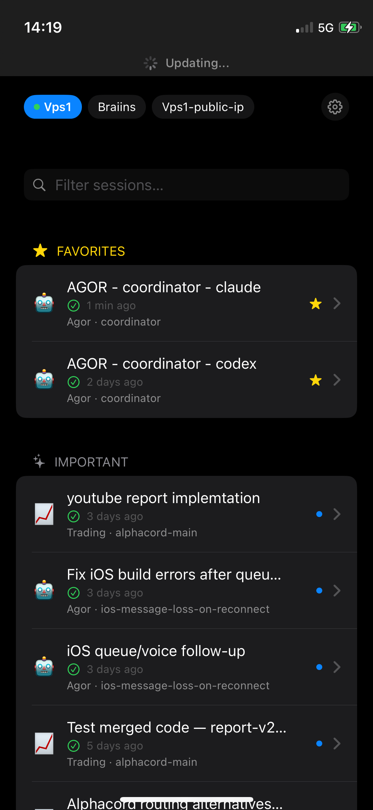
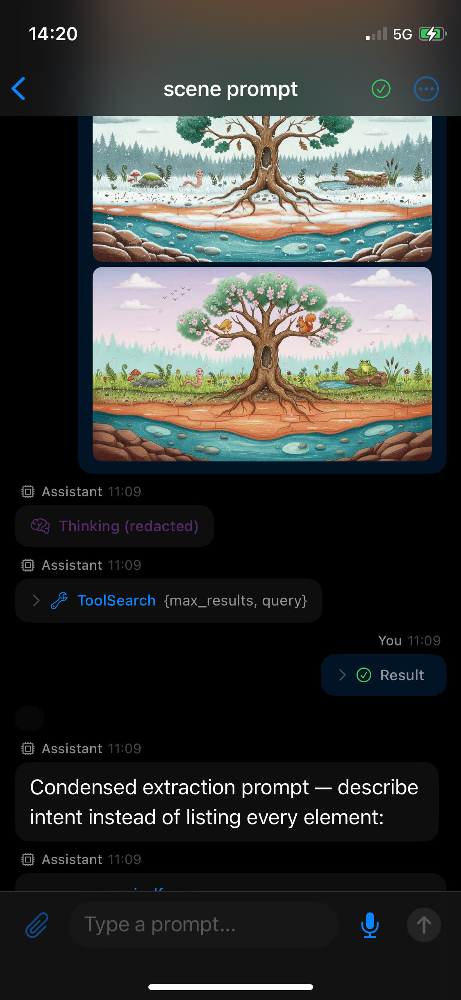
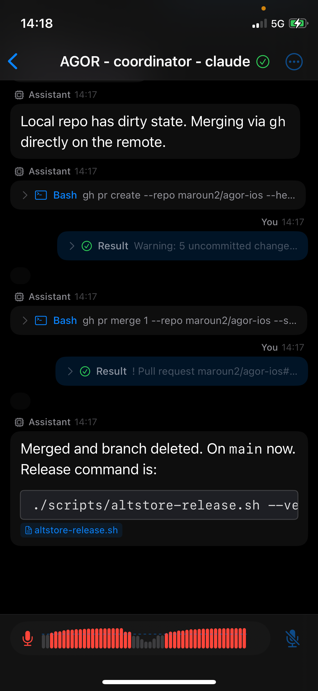

# Agor for iOS

Native iPhone client for [Agor](https://agor.live) — orchestrate Claude Code, Codex, and Gemini sessions, manage git worktrees, and collaborate with AI agents in real-time, all from your phone.

<p align="center">
  
  &nbsp;&nbsp;
  
  &nbsp;&nbsp;
  
</p>

## Features

- **Multi-server sidebar** — switch between Agor instances, browse boards → worktrees → sessions in a tree
- **Favorites & Important** — pin sessions, surface running/attention-needed ones automatically
- **Rich chat** — markdown rendering, syntax-highlighted code, inline images, collapsible thinking/tool blocks
- **Real-time streaming** — plain text while streaming, full markdown after completion
- **Permissions & input** — approve/deny tool execution and answer agent questions inline
- **Voice input** — dictate prompts with live waveform visualization
- **File browser** — navigate worktree files, view text and images
- **Session controls** — start, stop, archive, reset sessions; status icons with animations
- **Notifications** — local alerts when favorited sessions finish; cross-session toasts
- **Auto-reconnect** — phased reconnect banner on foreground resume, smart URL handling

## Install

### AltStore / SideStore

Add this source URL to [AltStore](https://altstore.io) or [SideStore](https://sidestore.io):

```
https://raw.githubusercontent.com/maroun2/agor-ios/main/altstore-source.json
```

### Build from Source

Requires macOS 15+, Xcode 16.x, and an iPhone with iOS 18+. See [Build & Deploy](#build--deploy) below.

## Build & Deploy

### Requirements

- macOS 15 (Sequoia) or later
- Xcode 16.x (NOT 26.x — requires macOS 26)
- Free Apple ID (no paid Developer Program needed for personal device)
- iPhone with iOS 18+
- [xcodegen](https://github.com/yonaskolb/XcodeGen) — `brew install xcodegen`

### Signing Setup (one-time)

1. Open Xcode → Settings → Accounts → `+` → Apple ID
2. Click your account → Manage Certificates → `+` → Apple Development
3. Get your Team ID:
   ```bash
   security find-certificate -a | grep "Apple Development"
   # Look for the 10-character string in parentheses
   ```
4. Set it in `project.yml`:
   ```yaml
   settings:
     DEVELOPMENT_TEAM: "YOUR10CHARID"
   ```

### Generate Project & Build

```bash
xcodegen generate
```

### Deploy to iPhone

The `deploy.sh` script handles build, signing, and install in one step:

```bash
bash deploy.sh
```

Or build and install manually:

```bash
xcodebuild -project AgorApp.xcodeproj \
  -scheme AgorApp \
  -destination 'platform=iOS,id=<device-udid>' \
  -allowProvisioningUpdates \
  -derivedDataPath .build/DerivedData \
  build

xcrun devicectl device install app \
  --device <device-udid> \
  .build/DerivedData/Build/Products/Release-iphoneos/AgorApp.app
```

Find your device UDID with `xcrun devicectl list devices`.

### First-Time Device Setup

1. Enable **Developer Mode**: Settings → Privacy & Security → Developer Mode → ON (requires restart)
2. Pair: `xcrun devicectl manage pair --device <device-id>`
3. After first install, trust the certificate: Settings → General → VPN & Device Management → Apple Development → Trust

### Connecting to the Daemon

On the login screen, enter your daemon address:
- **Local network:** `192.168.x.x` (find your Mac's IP with `ipconfig getifaddr en0`)
- **Remote:** any URL you use to access the daemon

The app automatically adds `http://` and `:3030` if missing, tries https fallback, and validates via `/health` before login.

<details>
<summary><strong>Simulator</strong></summary>

```bash
xcodebuild -project AgorApp.xcodeproj \
  -scheme AgorApp \
  -destination 'platform=iOS Simulator,name=iPhone 16' \
  -derivedDataPath .build/DerivedData \
  build

# Find simulator UUIDs
xcrun simctl list devices available | grep iPhone

# Boot, install, launch
xcrun simctl boot <simulator-uuid>
xcrun simctl install <simulator-uuid> .build/DerivedData/Build/Products/Debug-iphonesimulator/AgorApp.app
xcrun simctl launch <simulator-uuid> com.agor.AgorApp
```

</details>

<details>
<summary><strong>Architecture</strong></summary>

```
Views (SwiftUI) -> ViewModels (@Observable) -> Services -> Network (REST / Socket.IO)
                                                 |
                                           Models (Codable structs)
```

MVVM with a service layer. ViewModels own state and call services. Views are pure SwiftUI.

### Project Structure

```
AgorApp/
|-- AgorApp.swift                         # @main entry, notification permission
|
|-- Models/
|   |-- Session.swift                     # Session, SessionStatus, PermissionMode, GitState
|   |-- AgorTask.swift                    # Task, TaskStatus
|   |-- Message.swift                     # Message, MessageContent, ContentBlock, MessageRole
|   |-- Board.swift                       # Board
|   |-- Worktree.swift                    # Worktree
|   |-- User.swift                        # User, UserRole
|   |-- Permission.swift                  # PermissionRequestContent, PermissionStatus
|   |-- InputRequest.swift                # InputRequestContent, InputRequestQuestion
|   |-- Streaming.swift                   # StreamingMessage, chunk event types
|   |-- FileItem.swift                    # FileListItem, FileDetail
|   +-- Repo.swift                        # Repo
|
|-- Services/
|   |-- AgorClient.swift                  # REST client (URLSession + JWT)
|   |-- AuthService.swift                 # Login/logout, Keychain, smart URL, token refresh
|   |-- SocketService.swift               # Socket.IO connection + event routing + health check
|   |-- StreamingService.swift            # Chunk accumulation, 50ms debounce
|   +-- SidebarCache.swift                # JSON file cache with 1-hour TTL
|
|-- ViewModels/
|   |-- AppViewModel.swift                # Root: auth state, connection, daemon URL
|   |-- NavigationViewModel.swift         # Sidebar: boards -> worktrees -> sessions, polling
|   |-- ChatViewModel.swift               # Messages, streaming, prompts, permissions, input
|   +-- FileBrowserViewModel.swift        # Virtual directory tree from flat file list
|
|-- Views/
|   |-- App/
|   |   |-- ContentView.swift             # NavigationSplitView, reconnect banner, notifications
|   |   |-- ConnectionSetupView.swift     # Daemon URL + login form
|   |   +-- SettingsView.swift            # Account, connection, about
|   |
|   |-- Navigation/
|   |   |-- SidebarView.swift             # Board -> Worktree -> Session tree
|   |   |-- BoardRow.swift                # Board icon + name
|   |   |-- WorktreeRow.swift             # Worktree name + branch + project
|   |   +-- SessionRow.swift              # Title, status badge, agent icon
|   |
|   |-- Chat/
|   |   |-- ChatView.swift                # Conversation container, toolbar, file browser
|   |   |-- MessageBubble.swift           # Role-based message styling
|   |   |-- MessageContentView.swift      # Routes ContentBlock[] to subviews
|   |   |-- StreamingMessageView.swift    # Live-updating streaming content
|   |   |-- PromptInputBar.swift          # Text input + send button
|   |   +-- TaskHeader.swift              # Collapsible task divider
|   |
|   |-- MessageBlocks/
|   |   |-- TextBlockView.swift           # Markdown rendered text (Textual)
|   |   |-- ToolUseBlockView.swift        # Collapsible tool name + input
|   |   |-- ToolResultBlockView.swift     # Collapsible tool output
|   |   |-- ThinkingBlockView.swift       # Collapsible thinking content
|   |   |-- CodeBlockView.swift           # Syntax-highlighted code (Highlightr)
|   |   |-- PermissionCardView.swift      # Inline approve/deny card
|   |   +-- InputRequestCardView.swift    # Inline question card
|   |
|   |-- FileBrowser/
|   |   |-- FileBrowserView.swift         # Directory/file listing
|   |   +-- FileDetailView.swift          # File content display
|   |
|   +-- Common/
|       |-- StatusBadge.swift             # SF Symbol status icons
|       |-- AgentIcon.swift               # Agent tool icons
|       |-- ConnectionIndicator.swift     # Toolbar connection dot
|       +-- ToastView.swift               # Cross-session toast notifications
|
+-- Utilities/
    |-- KeychainHelper.swift
    |-- DateFormatting.swift
    |-- HapticFeedback.swift
    +-- JSONCoding.swift                  # Custom decoders for polymorphic content
```

### Tech Stack

| Dependency | Purpose |
|------------|---------|
| **SwiftUI** (iOS 18+) | `NavigationSplitView`, `@Observable`, declarative UI |
| **socket.io-client-swift** | Socket.IO client matching the FeathersJS server protocol |
| **Textual** | SwiftUI-native markdown rendering |
| **Highlightr** | Syntax highlighting via Highlight.js / JavaScriptCore |
| **URLSession** | Native HTTP, no extra deps |
| **Keychain** | Secure JWT + refresh token storage |

</details>

<details>
<summary><strong>API Reference</strong></summary>

### REST Endpoints

| Endpoint | Method | Purpose |
|----------|--------|---------|
| `/authentication` | POST | Login (email/password) |
| `/boards` | GET | List boards |
| `/worktrees?board_id=X` | GET | Worktrees for a board |
| `/sessions?worktree_id=X` | GET | Sessions for a worktree |
| `/tasks?session_id=X` | GET | Tasks for a session |
| `/messages?session_id=X` | GET | Messages (paginated) |
| `/sessions/:id/prompt` | POST | Send prompt |
| `/sessions/:id/permission-decision` | POST | Approve/deny permission |
| `/sessions/:id/input-response` | POST | Answer input request |
| `/sessions/:id/stop` | POST | Stop running session |
| `/sessions/:id` | PATCH | Archive/update session |
| `/file?worktree_id=X` | GET | List files in worktree |
| `/file/:path?worktree_id=X` | GET | Get file content |
| `/users` | GET | Current user info |
| `/health` | GET | Server health check |

### WebSocket Events

FeathersJS emits events as `"<service> <action>"`:

| Event | Purpose |
|-------|---------|
| `sessions patched` | Session status changes, cross-session notifications |
| `tasks created` | New task divider in chat |
| `tasks patched` | Task status update |
| `messages created` | New message (replaces streaming buffer) |
| `messages patched` | Permission/input status resolved |
| `messages streaming:start` | Begin streaming placeholder |
| `messages streaming:chunk` | Append text chunk |
| `messages streaming:end` | Finalize streaming, switch to markdown |
| `messages streaming:error` | Show error |
| `messages thinking:start` | Begin thinking block |
| `messages thinking:chunk` | Append thinking text |
| `messages thinking:end` | End thinking block |

</details>

## Notes

- **Free Apple ID certificates expire after 7 days** — rebuild and re-trust on the device
- **Paid Apple Developer Program** ($99/yr) gives 1-year certificates and App Store distribution
- **Build artifacts** go to `.build/DerivedData/` (gitignored)
- **iOS kills WebSocket ~5-30s after backgrounding** — the app reconnects automatically on foreground resume with a visual reconnect banner
- **No background push notifications** — local notifications fire for in-app events only. APNs would require server-side changes
- **Xcode 26.x won't open on macOS 15** — it requires macOS 26 (Tahoe). Use Xcode 16.x
- If `xcodebuild` fails with "No Account for Team", open Xcode GUI and press Cmd+R once to refresh the session

## License

[MIT](LICENSE)
